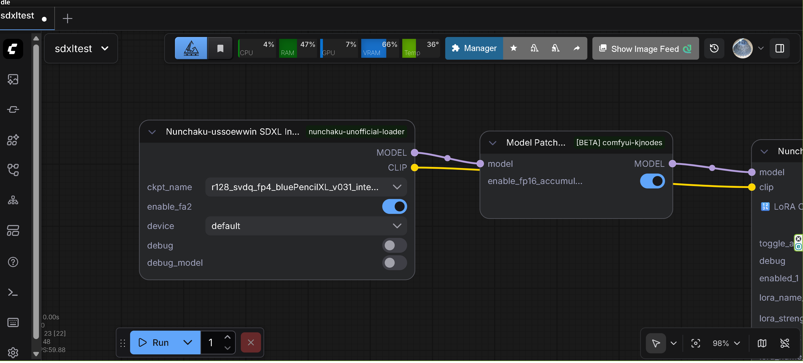
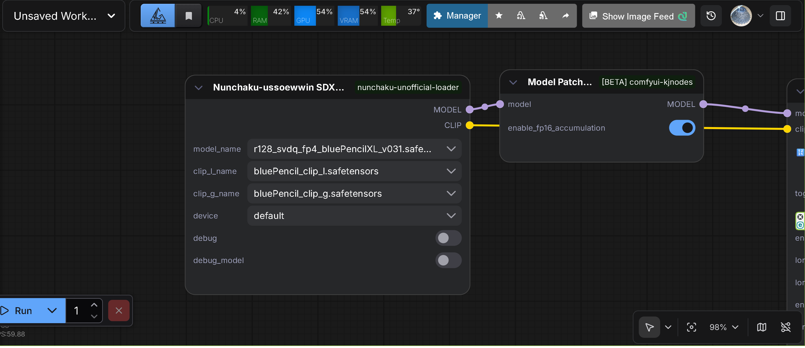
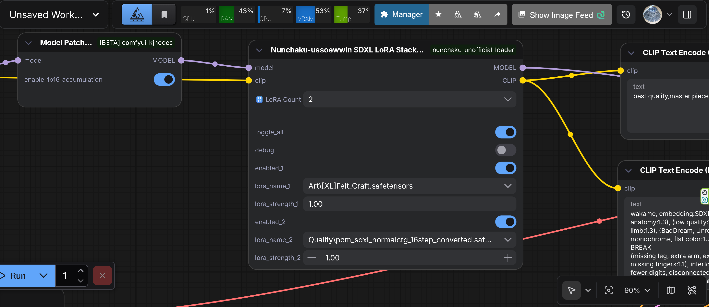
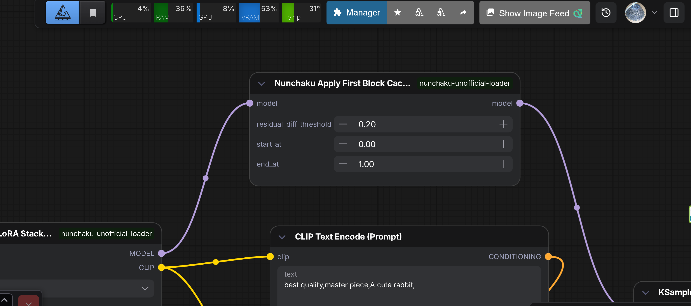
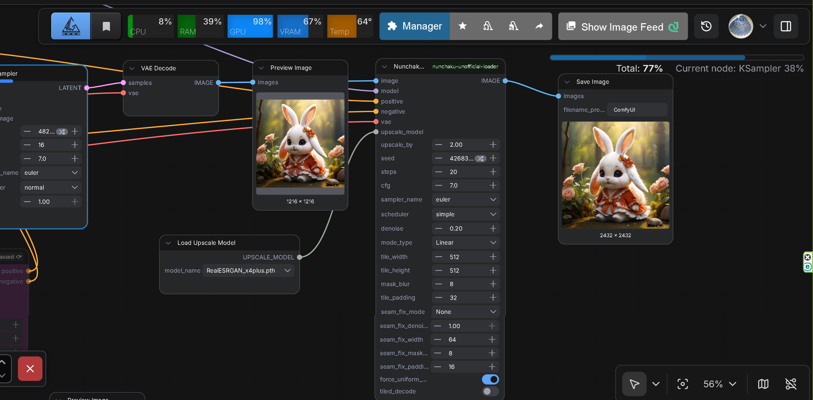
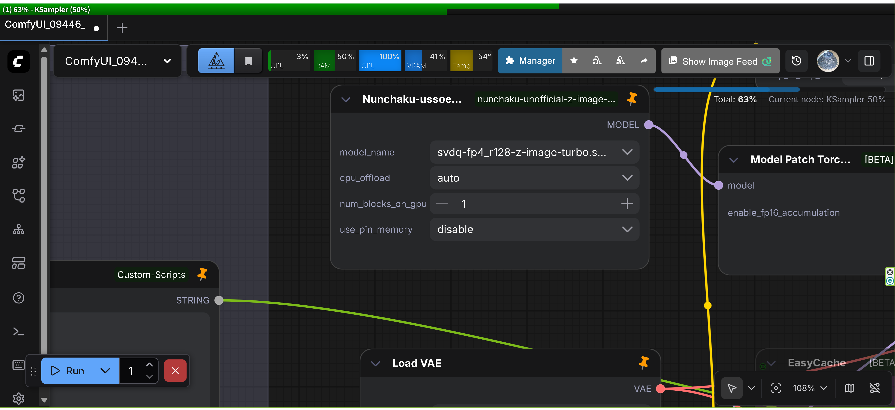

# ComfyUI-nunchaku-unofficial-loader
<p align="center">

</p>

## ⚠️ WARNING

This is an **UNOFFICIAL** test version of the node.  
It may not work correctly depending on your environment.  
**(Unfortunately, no speed advantage at present)**

These are Nunchaku unofficial loaders for using SDXL models quantized with SVDQ (SVDQuant) method, based on [ComfyUI-nunchaku](https://github.com/nunchaku-ai/ComfyUI-nunchaku) with custom additions.

## Installation

### Quick Install

Clone this repository into your ComfyUI `custom_nodes` directory:

```bash
# Windows
git clone https://github.com/ussoewwin/ComfyUI-nunchaku-unofficial-loader "%USERPROFILE%\ComfyUI\custom_nodes\ComfyUI-nunchaku-unofficial-loader"

# Linux/Mac
git clone https://github.com/ussoewwin/ComfyUI-nunchaku-unofficial-loader ~/ComfyUI/custom_nodes/ComfyUI-nunchaku-unofficial-loader
```

Restart ComfyUI to load the nodes.

## Requirements

**Nunchaku library**: You **MUST** have the Nunchaku library version **v1.1.0 or later** installed. This is a hard requirement - other versions will not work.

**Pre-built package**: If you are using Nunchaku with CUDA 13.0 (cu130), use the pre-built package available at [ussoewwin/nunchaku-build-on-cu130-windows](https://huggingface.co/ussoewwin/nunchaku-build-on-cu130-windows).

## Available Quantized Models

If you are using Nunchaku with CUDA 13.0 (cu130), use these quantized models:
- **[Nunchaku-R128-SDXL-Series](https://huggingface.co/ussoewwin/Nunchaku-R128-SDXL-Series)** - A collection of high-fidelity quantized SDXL models optimized using Nunchaku (SVDQ W4A4) engine with Rank 128 (r128) quantization.

## Sample Workflows

Sample ComfyUI workflows are available in the `sample` directory. These workflows demonstrate how to use the Nunchaku SDXL loaders and can be imported directly into ComfyUI.


- **[sdxltest.json](sample/sdxltest.json)** - Sample workflow demonstrating Nunchaku SDXL model loading and generation. This workflow showcases the basic usage of Nunchaku SDXL Integrated Loader with a complete generation pipeline.

To use these workflows:
1. Download the JSON file from the `sample` directory
2. Import it into ComfyUI using the "Load" button
3. Ensure you have the required models installed (see Requirements section)

## Nodes

### Nunchaku-ussoewwin SDXL Integrated Loader

⚠️ **WARNING**: Currently, with this loader, quantized models have no speed advantage compared to standard ComfyUI loaders, and generation speed may actually be slower.



A ComfyUI node for loading "unified" Nunchaku SDXL models that contain both UNet and CLIP in a single checkpoint file. This node behaves like a standard CheckpointLoader but uses Nunchaku for the UNet portion. <strong>(Unfortunately, no speed advantage at present)</strong>

#### Features

- **Unified Checkpoint Loading**: Loads both UNet and CLIP from a single checkpoint file
- **Flash Attention 2 Support**: Optional Flash Attention 2 acceleration for faster inference (enabled by default)
  - Automatically applies FA2 to all attention layers in the UNet model
  - Requires Flash Attention 2 to be installed in your environment
  - Can be disabled via the `enable_fa2` parameter if needed
- **Model Detection**: Automatically detects model configuration from checkpoint keys

#### Usage Notes

- **Checkpoint Format**: This node is designed for unified checkpoints that contain both UNet and CLIP in a single file
- **Compatibility**: Works with standard SDXL checkpoint formats that include both UNet and CLIP components

### Nunchaku-ussoewwin SDXL DiT Loader

⚠️ **WARNING**: This node is **for advanced users only**. UNet and CLIP split models are **not distributed by the author**. You need to build them yourself.



Important: **Nunchaku / DeepCompressor SDXL SVDQ-FP4 outputs are UNet-only**. They intentionally **do not include CLIP**.

Recommended setup:

- **UNet**: Nunchaku quantized SDXL UNet (`*_svdq_fp4.safetensors`)
- **CLIP**: standard SDXL fp16/bf16 checkpoint (e.g. `sd_xl_base_1.0.safetensors`)
- **VAE**: standard SDXL VAE

The node requires selecting a separate **CLIP checkpoint** because CLIP is not part of the quantized UNet file.

**Note**: UNet and CLIP split models are not provided by the author. You must build them yourself if you want to use this node.

#### Features

- **Flash Attention 2 Support**: Optional Flash Attention 2 acceleration for faster inference (enabled by default)
  - Automatically applies FA2 to all attention layers in the UNet model
  - Requires Flash Attention 2 to be installed in your environment
  - Can be disabled via the `enable_fa2` parameter if needed
  - Typically enables FA2 for 140 attention layers in SDXL models

### Nunchaku-ussoewwin SDXL LoRA Loader



A ComfyUI node for loading and applying LoRA (Low-Rank Adaptation) to Nunchaku quantized SDXL models.

#### Features

- **LoRA Loading**: Loads and applies LoRA files to Nunchaku quantized SDXL UNet models
- **Multiple LoRA Support**: Supports stacking multiple LoRAs with individual strength controls
- **SVDQ Compatibility**: Works with SVDQ quantized UNet models
- **Dynamic UI**: Automatically adjusts the number of visible LoRA slots based on configuration

### Nunchaku-ussoewwin Apply First Block Cache Patch Advanced



A ComfyUI node that implements the First Block Cache feature for Nunchaku SDXL models. This node caches the output of the first Transformer block and skips recalculation when similar, achieving significant speedup during sampling.

#### Features

- **First Block Caching**: Caches the output of the first Transformer block and skips subsequent block calculations when similar
- **Similarity Detection**: Uses normalized error threshold to determine if cached output can be reused
- **Multi-stage Sampler Support**: Automatically detects and disables cache for multi-stage samplers (HeunPP2, Heun++, etc.) to maintain quality
- **Timestep Range Control**: Configurable start and end timestep percentages for cache activation
- **Performance Optimization**: Achieves approximately 1.08-1.8x speedup with Euler samplers
- **Statistics Logging**: Provides detailed cache hit/miss statistics and estimated speedup

#### Usage Notes

- **Residual Diff Threshold**: 
  - `0.0`: Cache disabled (always calculates)
  - `0.12` (SDXL): Approximately 1.8x speedup
- **Sampler Compatibility**: Works best with Euler-family samplers. Multi-stage samplers (HeunPP2, Heun++, etc.) automatically disable cache to prevent image corruption
- **Model Support**: Compatible with Nunchaku SDXL (UNet-based) models

### Nunchaku Ultimate SD Upscale



A ComfyUI node for upscaling images using tile-based image-to-image processing, specifically optimized for Nunchaku SDXL models.

#### Features

- **Tile-based Upscaling**: Processes images in tiles to handle high-resolution upscaling efficiently
- **Color Normalization**: Always normalizes Nunchaku SDXL VAE output to full dynamic range (0.0-1.0) before upscaling, fixing pale/washed-out colors
- **Multiple Modes**: Supports Linear, Chess, and None tile modes
- **Seam Fixing**: Includes multiple seam fixing modes (None, Band Pass, Half Tile, Half Tile + Intersections)
- **Module Isolation**: Prevents module reference conflicts with other custom nodes

#### Usage Notes

- **Requires ComfyUI_UltimateSDUpscale**: This node requires the `ComfyUI_UltimateSDUpscale` custom node to be installed
- **Color Range**: Automatically normalizes Nunchaku SDXL VAE's compressed color range (e.g., 0.15-0.85) to full range (0.0-1.0) to restore proper contrast and color saturation
- **Module Safety**: Uses isolated module loading to prevent conflicts with other custom nodes

### Nunchaku-ussoewwin Z-Image-Turbo DiT Loader

⚠️ **WARNING**: This is an **unofficial experimental loader** created as a prototype before the release of ComfyUI-Nunchaku 1.1.0. This is the author's personal testing environment. **Do not use this node.**

A ComfyUI node for loading Nunchaku-quantized Z-Image-Turbo models. This node provides support for loading 4-bit quantized Z-Image-Turbo models that have been processed using SVDQuant quantization.



#### Features

- **Model Loading**: Loads Nunchaku-quantized Z-Image-Turbo diffusion transformer models
- **CPU Offloading**: Automatic or manual CPU offloading support to reduce VRAM usage
- **Memory Management**: Configurable GPU memory usage with transformer block offloading options
- **Hardware Compatibility**: Automatic hardware compatibility checks for quantization support
- **Precision Support**: Supports both INT4 and FP4 quantization precisions

## Changelog

### Version 2.6.2

- Fixed NunchakuUltimateSDUpscale node registration issue with Nunchaku 1.2.0
  - Improved error handling in INPUT_TYPES to prevent node registration failures
  - Node now appears in UI even if ComfyUI_UltimateSDUpscale import fails
  - See [Issue #2](https://github.com/ussoewwin/ComfyUI-nunchaku-unofficial-loader/issues/2) for details
- See [Release Notes v2.6.2](https://github.com/ussoewwin/ComfyUI-nunchaku-unofficial-loader/releases/tag/2.6.2) for details

### Version 2.6.1

- Optimized LoRA processing performance for SDXL models
- See [Release Notes v2.6.1](https://github.com/ussoewwin/ComfyUI-nunchaku-unofficial-loader/releases/tag/2.6.1) for details

### Version 2.6

- Fixed ControlNet support for SDXL models (OpenPose, Depth, Canny, etc.)
- See [Release Notes v2.6](https://github.com/ussoewwin/ComfyUI-nunchaku-unofficial-loader/releases/tag/2.6) for details

### Version 2.5

- Added SDXL Integrated Loader node for unified checkpoint loading
  - Supports loading both UNet and CLIP from a single checkpoint file
  - Includes Flash Attention 2 support (enabled by default)
  - Automatically detects model configuration from checkpoint keys
- Reorganized node documentation order
- Updated SDXL DiT Loader with advanced user warning
- See [Release Notes v2.5](https://github.com/ussoewwin/ComfyUI-nunchaku-unofficial-loader/releases/tag/2.5) for details

### Version 2.4

- Added Flash Attention 2 support for SDXL DiT Loader
  - Optional acceleration feature enabled by default
  - Automatically applies FA2 to all attention layers (typically 140 layers in SDXL models)
  - Requires Flash Attention 2 to be installed in your environment
  - Can be disabled via the `enable_fa2` parameter if needed
- Updated SDXL DiT Loader node image
- See [Release Notes v2.4](https://github.com/ussoewwin/ComfyUI-nunchaku-unofficial-loader/releases/tag/2.4) for details

### Version 2.3

- Added Nunchaku Ultimate SD Upscale nodes with improved color normalization
- Improved First Block Cache with residual injection for better quality
- Fixed USDU color normalization for Nunchaku SDXL VAE output
- Fixed module reference separation to prevent data loss
- Optimized cache similarity calculation using fused kernels
- Added Flash Attention 2 support for SDXL DiT Loader (optional, enabled by default)
- See [Release Notes v2.3](https://github.com/ussoewwin/ComfyUI-nunchaku-unofficial-loader/releases/tag/2.3) for details

### Version 2.2

- Added First Block Cache feature for Nunchaku SDXL models
- See [Release Notes v2.2](https://github.com/ussoewwin/ComfyUI-nunchaku-unofficial-loader/releases/tag/2.2) for details

### Version 2.1

- Published LoRA Loader technical documentation
- See [Release Notes v2.1](https://github.com/ussoewwin/ComfyUI-nunchaku-unofficial-z-image-turbo-loader/releases/tag/2.1) for details

### Version 2.0

- Added SDXL DIT Loader support
- Added SDXL LoRA support
- Added ControlNet support for SDXL models
- See [Release Notes v2.0](https://github.com/ussoewwin/ComfyUI-nunchaku-unofficial-z-image-turbo-loader/releases/tag/2.0) for details

### Version 1.1

- Added Diffsynth ControlNet support for Z-Image-Turbo models
  - Note: Does not work with standard model patch loader. Requires a custom node developed by the author.
- See [Release Notes v1.1](https://github.com/ussoewwin/ComfyUI-nunchaku-unofficial-z-image-turbo-loader/releases/tag/1.1) for details

### 2025-12-25

- Fixed import error for `NunchakuZImageDiTLoader` node by improving alternative import method with better path resolution (see [Issue #1](issues/1))

## Safety & License Notice

### Model Distribution & Usage

* **This repository does NOT distribute any model checkpoints, weights, or training data.**
* All model files (including SDXL checkpoints, quantized UNet files, CLIP, VAE, LoRA, and ControlNet models) **must be obtained separately by the user**.
* Users are solely responsible for ensuring that **all downloaded or generated model files comply with their respective licenses** (e.g., CreativeML Open RAIL, Apache-2.0, custom research licenses, etc.).
* The author does **not grant any rights** to redistribute, modify, or use third-party models beyond what is permitted by their original licenses.

### Quantized & Derived Models

* Quantized models (e.g., SVDQ / FP4 / INT4) are considered **derivative works** of the original checkpoints.
* Before sharing or redistributing quantized models, verify that the **original model license explicitly allows redistribution and derivative works**.
* Many SDXL-based models **do not permit redistribution**, even in quantized form.

### Experimental / Unofficial Status

* This project is an **UNOFFICIAL and experimental implementation**.
* It is **not affiliated with, endorsed by, or supported by the Nunchaku or ComfyUI core teams**.
* Behavior, performance, and compatibility may change without notice.
* Use at your own risk.

## License (Apache License 2.0)

This project is licensed under the **Apache License, Version 2.0**.

### Key Points

* Copyright © 2024–2025 ussoewwin
* You are free to **use, modify, and distribute** this software, including for commercial purposes.
* You **must retain**:
  * The original copyright notice
  * A copy of the Apache-2.0 license
  * Any existing NOTICE files (if present)
* If you modify the source code, you **must clearly indicate** that changes were made.
* This software is provided **"AS IS"**, without warranties or conditions of any kind.

See the full license text in [`LICENCE.txt`](./LICENCE.txt).
