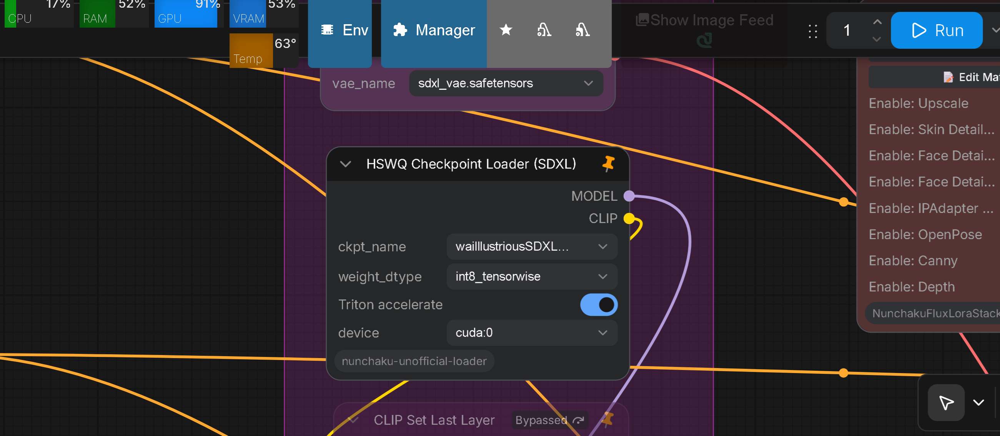
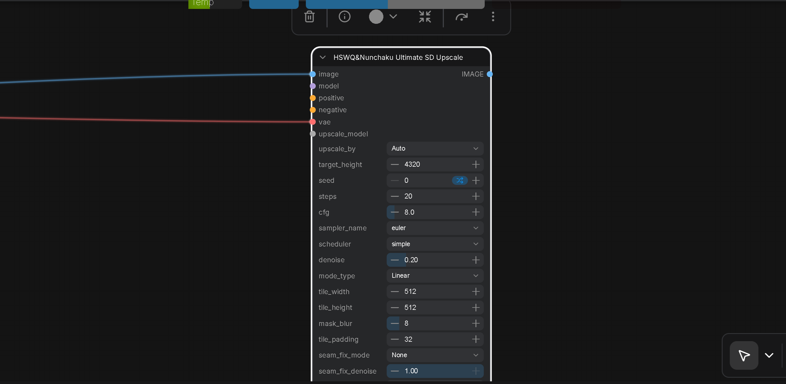
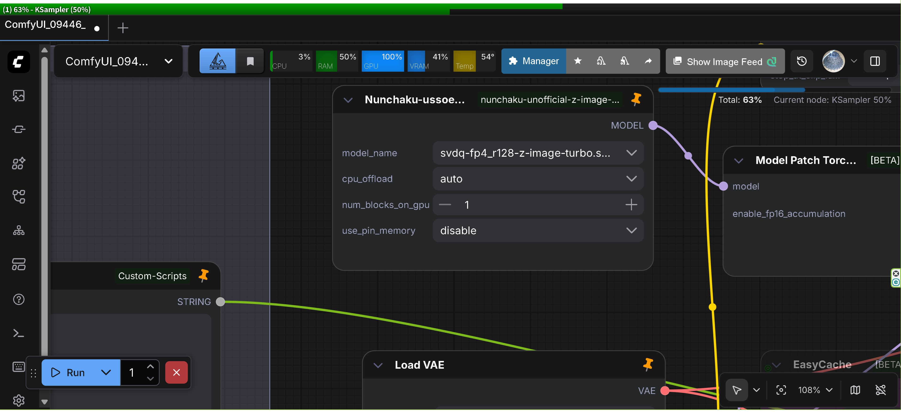

# ComfyUI-HSWQ-and-nunchaku-unofficial-loader

<p align="center">

</p>

## ⚠️ IMPORTANT NOTICE – SDXL SVDQ DEPRECATION

After extensive long-term testing, repeated real-world benchmarking, and significant development effort devoted specifically to improving generation speed and VRAM efficiency, active development of SDXL SVDQ (4-bit) support in this repository has been discontinued.

Throughout this process, multiple optimization strategies were evaluated, including kernel behavior analysis, runtime integration adjustments, and execution-path tuning. However, despite these efforts, the fundamental limitations of SDXL SVDQ remained unchanged.

For SDXL models, SVDQ / FP4 quantization does **NOT** provide practical advantages over standard fp16 execution:

- No consistent generation speed improvement, even after extensive tuning
- No meaningful VRAM reduction in real-world usage scenarios
- Additional runtime overhead caused by fp16 conversion, kernel dispatch, and integration costs

While a reduction in model file size was achieved, this factor alone is insufficient to justify continued SDXL SVDQ support, given the lack of runtime and memory efficiency benefits.

As a result:

- SDXL SVDQ models (e.g. Nunchaku-R128-SDXL-Series) are deprecated
- Related Hugging Face repositories have been removed
- SDXL SVDQ should be considered experimental / archival only
- This repository will no longer be updated with new SDXL SVDQ models.

### Future Direction: fp8e4m3

Future SDXL-related development efforts are shifting toward fp8e4m3-based compression and formats.

This decision is based on extensive comparative testing, which demonstrated that fp8e4m3 provides a substantially better balance between performance, memory usage, and image quality:

- Fully compatible with standard ComfyUI loaders
- Image quality effectively equivalent to fp16
- No generation speed penalty
- No increase in VRAM usage
- Model size reduction comparable to 4-bit SVDQ, without its runtime drawbacks

fp8e4m3-based SDXL models, compression scripts, and related technical documentation will continue to be published separately.

The fp8e4m3 development is **[Hybrid-Sensitivity-Weighted-Quantization (HSWQ)](https://github.com/ussoewwin/Hybrid-Sensitivity-Weighted-Quantization)**. HSWQ is a novel FP8 E4M3 quantization method that combines sensitivity analysis and importance-weighted histogram optimization, achieving superior quality compared to naive uniform quantization while maintaining standard loader compatibility.

- **Quantized HSWQ SDXL models:** [Hugging Face — Hybrid-Sensitivity-Weighted-Quantization-SDXL-fp8e4m3](https://huggingface.co/ussoewwin/Hybrid-Sensitivity-Weighted-Quantization-SDXL-fp8e4m3)

<p align="center">

</p>

## Installation

### Quick Install

Clone this repository into your ComfyUI `custom_nodes` directory:

```bash
# Windows
git clone https://github.com/ussoewwin/ComfyUI-nunchaku-unofficial-loader "%USERPROFILE%\ComfyUI\custom_nodes\ComfyUI-nunchaku-unofficial-loader"

# Linux/Mac
git clone https://github.com/ussoewwin/ComfyUI-nunchaku-unofficial-loader ~/ComfyUI/custom_nodes/ComfyUI-nunchaku-unofficial-loader
```

Restart ComfyUI to load the nodes.

## Requirements

**Nunchaku library**: You **MUST** have the Nunchaku library version **v1.1.0 or later** installed. This is a hard requirement - other versions will not work.

**Pre-built package**: If you are using Nunchaku with CUDA 13.0 (cu130), use the pre-built package available at [ussoewwin/nunchaku-build-on-cu130-windows](https://huggingface.co/ussoewwin/nunchaku-build-on-cu130-windows).

## Nodes

### Checkpoint Loader (SDXL)



A ComfyUI node that loads **MODEL** and **CLIP** from standard SDXL checkpoints, with optional device selection and FP8 precision support. Use it like the standard Load Checkpoint node; it outputs MODEL and CLIP only (no VAE).

#### Features

- **Checkpoint Loading**: Loads both UNet (MODEL) and CLIP from a single SDXL checkpoint file (same as standard Load Checkpoint)
- **Device Selection**: Optional device parameter to choose GPU (e.g. `cuda:0`, `cuda:1`) or CPU for model loading
- **FP8 Precision**: Supports `default`, `fp8_e4m3fn`, `fp8_e4m3fn_fast`, and `fp8_e5m2` weight dtypes for memory-efficient inference
- **Standard ComfyUI Integration**: Uses `load_checkpoint_guess_config`; compatible with standard ComfyUI workflows

#### Usage Notes

- **Inputs**: `ckpt_name` (checkpoint file), `weight_dtype` (precision), and optionally `device`
- **Outputs**: MODEL and CLIP only; use a separate VAE loader if needed
- **Category**: Loaders (`loaders`)

### HSWQ&Nunchaku Ultimate SD Upscale



A ComfyUI node for upscaling images using tile-based image-to-image processing, specifically optimized for Nunchaku SDXL models.

#### Features

- **Tile-based Upscaling**: Processes images in tiles to handle high-resolution upscaling efficiently
- **Color Normalization**: Always normalizes Nunchaku SDXL VAE output to full dynamic range (0.0-1.0) before upscaling, fixing pale/washed-out colors
- **Multiple Modes**: Supports Linear, Chess, and None tile modes
- **Seam Fixing**: Includes multiple seam fixing modes (None, Band Pass, Half Tile, Half Tile + Intersections)
- **Module Isolation**: Prevents module reference conflicts with other custom nodes

#### Usage Notes

- **Standalone**: This node does **not** require `ComfyUI_UltimateSDUpscale`. It uses a bundled copy (`usdu_bundle`) and works on its own. You can use this node without installing any other Ultimate SD Upscale extension.
- **Color Range**: Automatically normalizes Nunchaku SDXL VAE's compressed color range (e.g., 0.15-0.85) to full range (0.0-1.0) to restore proper contrast and color saturation
- **Module Safety**: Uses isolated module loading to prevent conflicts with other custom nodes

#### FP8 (fp8e4m3) and torch.compile
- **Purpose:** Use this node with FP8 quantized models (e.g. HSWQ SDXL) and torch.compile together.
- **Patches:** On load, this extension applies compatibility patches (`usdu_compat_patches.py`) that fix copy_ shape mismatch, FP8 linear/addmm bias–out_features mismatch, control embedder weight layout, and Lumina modulate/apply_gate dimension issues so the node works with FP8 and torch.compile.

### Nunchaku-ussoewwin Z-Image-Turbo DiT Loader

⚠️ **WARNING**: This is an **unofficial experimental loader** created as a prototype before the release of ComfyUI-Nunchaku 1.1.0. This is the author's personal testing environment. **Do not use this node.**

A ComfyUI node for loading Nunchaku-quantized Z-Image-Turbo models. This node provides support for loading 4-bit quantized Z-Image-Turbo models that have been processed using SVDQuant quantization.



#### Features

- **Model Loading**: Loads Nunchaku-quantized Z-Image-Turbo diffusion transformer models
- **CPU Offloading**: Automatic or manual CPU offloading support to reduce VRAM usage
- **Memory Management**: Configurable GPU memory usage with transformer block offloading options
- **Hardware Compatibility**: Automatic hardware compatibility checks for quantization support
- **Precision Support**: Supports both INT4 and FP4 quantization precisions

## Changelog

See [changelog.md](changelog.md).

## Safety & License Notice

### Model Distribution & Usage

* **This repository does NOT distribute any model checkpoints, weights, or training data.**
* All model files (including SDXL checkpoints, quantized UNet files, CLIP, VAE, LoRA, and ControlNet models) **must be obtained separately by the user**.
* Users are solely responsible for ensuring that **all downloaded or generated model files comply with their respective licenses** (e.g., CreativeML Open RAIL, Apache-2.0, custom research licenses, etc.).
* The author does **not grant any rights** to redistribute, modify, or use third-party models beyond what is permitted by their original licenses.

### Quantized & Derived Models

* Quantized models (e.g., SVDQ / FP4 / INT4) are considered **derivative works** of the original checkpoints.
* Before sharing or redistributing quantized models, verify that the **original model license explicitly allows redistribution and derivative works**.
* Many SDXL-based models **do not permit redistribution**, even in quantized form.

### Experimental / Unofficial Status

* This project is an **UNOFFICIAL and experimental implementation**.
* It is **not affiliated with, endorsed by, or supported by the Nunchaku or ComfyUI core teams**.
* Behavior, performance, and compatibility may change without notice.
* Use at your own risk.

## License (Apache License 2.0)

This project is licensed under the **Apache License, Version 2.0**.

### Key Points

* Copyright © 2024–2025 ussoewwin
* You are free to **use, modify, and distribute** this software, including for commercial purposes.
* You **must retain**:
  * The original copyright notice
  * A copy of the Apache-2.0 license
  * Any existing NOTICE files (if present)
* If you modify the source code, you **must clearly indicate** that changes were made.
* This software is provided **"AS IS"**, without warranties or conditions of any kind.

See the full license text in [`LICENCE.txt`](./LICENCE.txt).
