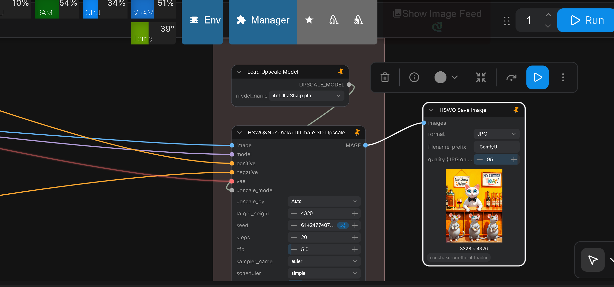
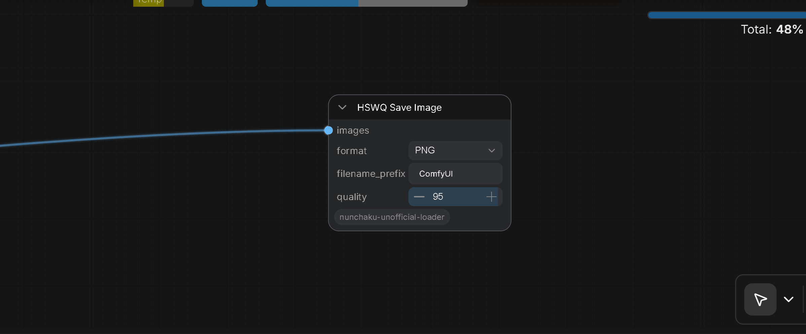
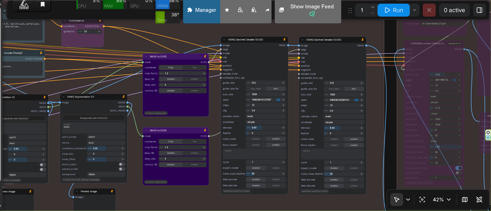
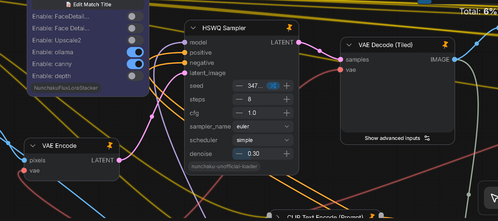

# ComfyUI-HSWQ-and-unofficial-nunchaku-loader

<p align="center">

</p>

## Overview

This custom node pack loads and runs **[Hybrid-Sensitivity-Weighted-Quantization (HSWQ)](https://github.com/ussoewwin/Hybrid-Sensitivity-Weighted-Quantization)** packs and related ComfyUI-compatible quantized SDXL / Z Image weights.

HSWQ is a high-fidelity quantization line for diffusion UNets. Current public HSWQ work focuses on **ConvRot INT8** and **ConvRot NVFP4** for **SDXL** (sensitivity / importance analysis, DualMonitor + weighted-histogram FP16 protection, then FULL ConvRot on the remainder). It is **not** a keep-ratio percentage scheme: keep ratio is fixed at **0 (r0)**; FP16 layers are chosen by automatic analysis under a fixed MiB budget.

| Path | Role in this repo |
| :--- | :--- |
| **HSWQ ConvRot INT8 (SDXL V3.1)** | ComfyUI `int8_tensorwise` packs; load via **HSWQ Checkpoint Loader (SDXL)** / diffusion loaders with INT8 dispatch |
| **HSWQ ConvRot NVFP4 (SDXL)** | ComfyUI `nvfp4` packs (Linear→NVFP4, Conv2d→INT8); load via the NVFP4 path in this extension |
| **FP8 (E4M3)** | HSWQ **FP8 development has ended** (technical docs remain upstream). Loaders here may still accept existing FP8 weights where ComfyUI supports them |
| **Z Image 8-bit** | HSWQ-specific Z Image INT8 development / publication **ended**. Prefer **native ConvRot INT8** for Z Image (typically SSIM > 0.99). HSWQ INT8 continues for **SDXL** |

Upstream HSWQ targets (reference): ConvRot INT8 SSIM about **0.94–0.98**, ConvRot NVFP4 about **0.95**, with roughly **30–40%** smaller files than FP16 while keeping standard ComfyUI loader compatibility.

**Quantization scripts, How-to docs, and benchmarks:** [ussoewwin/Hybrid-Sensitivity-Weighted-Quantization](https://github.com/ussoewwin/Hybrid-Sensitivity-Weighted-Quantization)

**Published HSWQ SDXL models (ConvRot INT8):** [Hugging Face — Hybrid-Sensitivity-Weighted-Quantization-SDXL-ConvRot-INT8](https://huggingface.co/ussoewwin/Hybrid-Sensitivity-Weighted-Quantization-SDXL-ConvRot-INT8)

**Published HSWQ SDXL models (ConvRot NVFP4):** [Hugging Face — Hybrid-Sensitivity-Weighted-Quantization-SDXL-ConvRot-NVFP4](https://huggingface.co/ussoewwin/Hybrid-Sensitivity-Weighted-Quantization-SDXL-ConvRot-NVFP4)

<p align="center">

</p>

## Installation

### Quick Install

Clone this repository into your ComfyUI `custom_nodes` directory:

```bash
# Windows
git clone https://github.com/ussoewwin/ComfyUI-nunchaku-unofficial-loader "%USERPROFILE%\ComfyUI\custom_nodes\ComfyUI-nunchaku-unofficial-loader"

# Linux/Mac
git clone https://github.com/ussoewwin/ComfyUI-nunchaku-unofficial-loader ~/ComfyUI/custom_nodes/ComfyUI-nunchaku-unofficial-loader
```

Restart ComfyUI to load the nodes.

## Nodes

### HSWQ Checkpoint Loader (SDXL)


ComfyUI node that loads **MODEL** and **CLIP** from standard SDXL checkpoints, with optional device selection and **FP8 / INT8** precision support. Use it like the standard Load Checkpoint node; it outputs MODEL and CLIP only (no VAE). Scope is **general FP8 and INT8** (including HSWQ and native comfy_quant), not limited to HSWQ-only weights.

This loader does **not** ship an in-node Triton accelerate toggle. INT8 Linear speed is left to **ComfyUI + `comfy_kitchen`** (`int8_linear`: cuda → triton → eager). This extension only keeps INT8 **load compatibility** patches (Conv2d / LoRA / ControlLora / handoff).

#### Features

- **Checkpoint Loading**: Loads both UNet (MODEL) and CLIP from a single SDXL checkpoint file (same as standard Load Checkpoint)
- **Device Selection**: Optional device parameter to choose GPU (e.g. `cuda:0`, `cuda:1`) or CPU for model loading
- **FP8 weight dtype**: `default`, `fp8_e4m3fn`, `fp8_e4m3fn_fast`, `fp8_e5m2`
- **INT8 weight dtype**: `int8_tensorwise` — native **comfy_quant** / `int8_tensorwise` via ComfyUI `MixedPrecisionOps` (this extension also patches **Conv2d** quant load so SD UNet INT8 works, not Linear-only)
- **INT8 auto-detect**: If the safetensors looks like comfy_quant INT8, the loader uses the MixedPrecisionOps path even when `weight_dtype` is not set to `int8_tensorwise` (does not force float8 over int8 weights)
- **Standard ComfyUI Integration**: Uses `load_checkpoint_guess_config`; compatible with standard ComfyUI workflows
- **No Triton accelerate widget**: UI is checkpoint / weight dtype / device only; fused INT8 Linear acceleration is not controlled from this node

#### Usage Notes

- **Inputs**: `ckpt_name` (checkpoint file), `weight_dtype` (`default` / FP8 options / `int8_tensorwise`), and optionally `device`
- **Outputs**: MODEL and CLIP only; use a separate VAE loader if needed
- **Category**: Loaders (`loaders`)
- **INT8 speed**: Rely on ComfyUI / `comfy_kitchen` for Linear acceleration; this node does not install or toggle Triton
- **INT8 + LoRA**: For INT8 LoRA bake / Status logging details, see `md/HSWQ_INT8_AND_LORA_TECHNICAL_GUIDE.md`

### HSWQ&Nunchaku Ultimate SD Upscale



ComfyUI node for upscaling images using tile-based image-to-image processing, specifically optimized for Nunchaku SDXL models.

#### Features

- **Tile-based Upscaling**: Processes images in tiles to handle high-resolution upscaling efficiently
- **Color Normalization**: Always normalizes Nunchaku SDXL VAE output to full dynamic range (0.0-1.0) before upscaling, fixing pale/washed-out colors
- **Multiple Modes**: Supports Linear, Chess, and None tile modes
- **Seam Fixing**: Includes multiple seam fixing modes (None, Band Pass, Half Tile, Half Tile + Intersections)
- **Module Isolation**: Prevents module reference conflicts with other custom nodes

#### Upscale magnification (`upscale_by` / `target_height`)

- **`upscale_by`**: Dropdown with **Auto** or fixed magnification values from **0.05** to **4.00** (step 0.05).
- **`target_height`**: Target output height in pixels (default **4320**). Used **only when `upscale_by` is Auto**.
- **Auto mode**: Reads the input image height from the connected `image`, then sets  
  `scale = target_height / input_height` (clamped to 0.05–4.0).
- **Fixed magnification**: When you pick a numeric value (e.g. **2.00**), that scale is used directly and **`target_height` is ignored**.

Example: input height 1080, `upscale_by = Auto`, `target_height = 4320` → scale 4.0 → output height 4320.

#### Usage Notes

- **Standalone**: This node does **not** require `ComfyUI_UltimateSDUpscale`. It uses a bundled copy (`usdu_bundle`) and works on its own. You can use this node without installing any other Ultimate SD Upscale extension.
- **Color Range**: Automatically normalizes Nunchaku SDXL VAE's compressed color range (e.g., 0.15-0.85) to full range (0.0-1.0) to restore proper contrast and color saturation
- **Module Safety**: Uses isolated module loading to prevent conflicts with other custom nodes

#### FP8 (fp8e4m3) and torch.compile
- **Purpose:** Use this node with FP8 quantized models (e.g. HSWQ SDXL) and torch.compile together.
- **Patches:** On load, this extension applies compatibility patches (`usdu_compat_patches.py`) that fix copy_ shape mismatch, FP8 linear/addmm bias–out_features mismatch, control embedder weight layout, and Lumina modulate/apply_gate dimension issues so the node works with FP8 and torch.compile.

### HSWQ Save Image



ComfyUI output node that saves images to your ComfyUI **output** folder as **PNG** or **JPG**.

#### Features

- **Format selection**: **PNG** (default) or **JPG**
- **Filename prefix**: Same behavior as the built-in Save Image node (default `ComfyUI`)
- **JPEG quality**: **quality (JPG only)** (1–100, default 95); ignored when format is PNG
- **PNG metadata**: Embeds workflow `prompt` and `extra_pnginfo` in PNG text chunks when available

#### Usage Notes

- **Inputs**: `images` (IMAGE), `format`, `filename_prefix`, `quality (JPG only)`
- **Category**: `image` (output node; no return socket)
- **Output path**: Uses ComfyUI's standard output directory via `folder_paths.get_output_directory()`

### HSWQ FP8 E4M3/INT8 UNet Loader


Standard ComfyUI UNet loader wrapper that loads FP8 and INT8 diffusion models (**general FP8 and INT8**, not limited to HSWQ-only weights). Loads the UNet (MODEL) from FP8 / INT8 checkpoints like the standard UNet loader (HSWQ FP8 E4M3, Scaled FP8, and native comfy_quant / `int8_tensorwise` when selected or auto-detected).

This loader does **not** ship an in-node Triton accelerate toggle. INT8 Linear speed is left to **ComfyUI + `comfy_kitchen`** (`int8_linear`: cuda → triton → eager). UI inputs are UNet name / weight dtype only; this extension keeps INT8 **load compatibility** patches (Conv2d / LoRA / ControlLora / handoff), not a separate Triton accelerate widget.

### HSWQ Batched Detailer (SEGS)



**Detailer (SEGS)**-style node that processes face (or other) segments in **three phases** instead of per-segment encode → sample → decode. This greatly reduces how often VAE and UNet are loaded and unloaded when using Dynamic VRAM Loading.

#### Problem with per-segment processing

Typical DetailerForEach runs, for each segment:

1. VAE encode  
2. KSampler (UNet)  
3. VAE decode  

So the pipeline does: VAE load → UNet load → VAE load → UNet load → … With many segments this causes repeated model switches and Dynamic VRAM reloads, leading to long stalls (especially with CUDAGraphs).

#### What HSWQ Batched Detailer does

- **Phase 1 (VAE)**: Encode all segments → VAE is loaded once.  
- **Phase 2 (UNet)**: Run KSampler for all encoded latents → UNet is loaded once.  
- **Phase 3 (VAE)**: Decode all refined latents and paste back → VAE is loaded once.

Model switches drop from **O(3n)** to **O(2)** (one VAE load, one UNet load per run). Input/output (INPUT_TYPES, RETURN_TYPES, etc.) is compatible with the original Detailer (SEGS) interface; behavior for a single segment is unchanged.

**Requirement**: [ComfyUI-Impact-Pack](https://github.com/ltdrdata/ComfyUI-Impact-Pack) (or equivalent that provides the DetailerForEach SEGS behavior) is required.

### HSWQ Sampler



A KSampler-equivalent node that behaves exactly like the standard ComfyUI KSampler, but **automatically adds all of RES4LYF's samplers and schedulers** when [RES4LYF](https://github.com/ClownsharkBatwing/RES4LYF) is installed. It reproduces the dynamic sampler generation logic found in Forge so that the full Runge-Kutta (`rk_beta`) sampler family stays selectable and runnable in vanilla ComfyUI.

#### Why this node exists

In Forge, RES4LYF's `beta/__init__.py` dynamically generates wrapper functions calling `sample_rk_beta` for every entry in `RK_SAMPLER_NAMES_BETA_NO_FOLDERS` (100+ RK samplers) and registers them into `extra_samplers`. The ComfyUI version of RES4LYF does not contain this logic, so many of those samplers become unselectable from the standard KSampler. This node supplements that missing difference.

#### Features

- **Standard KSampler behavior**: Same inputs (`model`, `seed`, `steps`, `cfg`, `sampler_name`, `scheduler`, `positive`, `negative`, `latent_image`, `denoise`) and output (`LATENT`); backed by `nodes.common_ksampler`
- **Automatic RES4LYF sampler discovery**: Scans `sys.modules` at `INPUT_TYPES` time, handling both `RES4LYF` and `custom_nodes.RES4LYF` module names (with a partial-match fallback), so load order does not matter
- **Forge-identical RK wrapper generation**: Builds `sample_fn` / `sample_ode_fn` closures for all RK sampler names, auto-generating ODE variants while excluding implicit samplers (gauss-legendre, radau, lobatto, etc.)
- **Reliable re-injection**: Registers every sampler into both `KSampler.SAMPLERS` (UI selectable) and `comfy.k_diffusion.sampling` via `setattr` (actual inference), guarding against RES4LYF's `importlib.reload()` wiping out function references
- **Scheduler merge**: Includes ComfyUI's `SCHEDULER_HANDLERS` in addition to the standard scheduler list

#### Usage Notes

- **Optional dependency**: Without RES4LYF installed, it works as a plain KSampler
- **Category**: `sampling`
- **Extensibility**: Designed as a thin UI wrapper so future HSWQ / Z-Image quantized-inference arguments can be intercepted in `sample()` without patching the ComfyUI core
- **Details**: See `md/hswq_sampler_technical_reference.md`

## Changelog

See [changelog.md](changelog.md).

## Safety & License Notice

### Model Distribution & Usage

* **This repository does NOT distribute any model checkpoints, weights, or training data.**
* All model files (including SDXL checkpoints, quantized UNet files, CLIP, VAE, LoRA, and ControlNet models) **must be obtained separately by the user**.
* Users are solely responsible for ensuring that **all downloaded or generated model files comply with their respective licenses** (e.g., CreativeML Open RAIL, Apache-2.0, custom research licenses, etc.).
* The author does **not grant any rights** to redistribute, modify, or use third-party models beyond what is permitted by their original licenses.

### Quantized & Derived Models

* Quantized models (e.g., SVDQ / FP4 / INT4) are considered **derivative works** of the original checkpoints.
* Before sharing or redistributing quantized models, verify that the **original model license explicitly allows redistribution and derivative works**.
* Many SDXL-based models **do not permit redistribution**, even in quantized form.

### Experimental / Unofficial Status

* This project is an **UNOFFICIAL and experimental implementation**.
* It is **not affiliated with, endorsed by, or supported by the Nunchaku or ComfyUI core teams**.
* Behavior, performance, and compatibility may change without notice.
* Use at your own risk.

## License (Apache License 2.0)

This project is licensed under the **Apache License, Version 2.0**.

### Key Points

* Copyright © 2024–2025 ussoewwin
* You are free to **use, modify, and distribute** this software, including for commercial purposes.
* You **must retain**:
  * The original copyright notice
  * A copy of the Apache-2.0 license
  * Any existing NOTICE files (if present)
* If you modify the source code, you **must clearly indicate** that changes were made.
* This software is provided **"AS IS"**, without warranties or conditions of any kind.

See the full license text in [`LICENCE.txt`](./LICENCE.txt).
